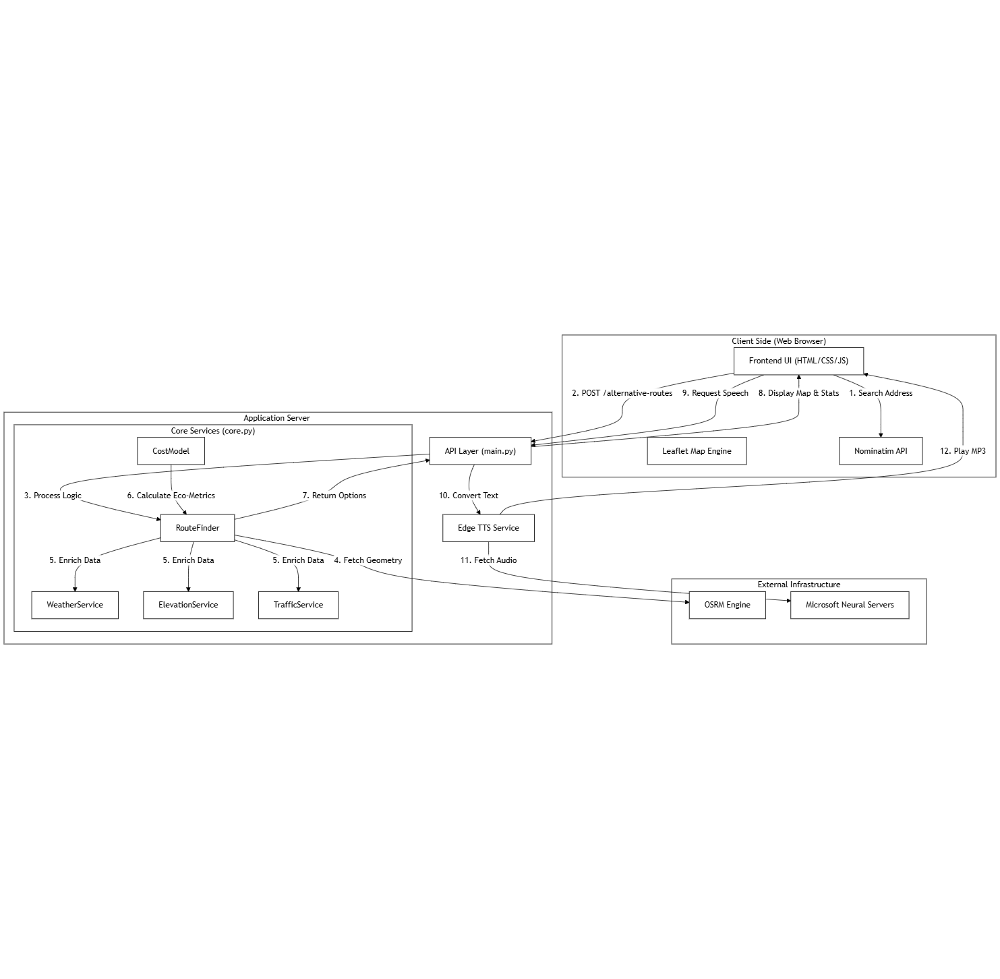
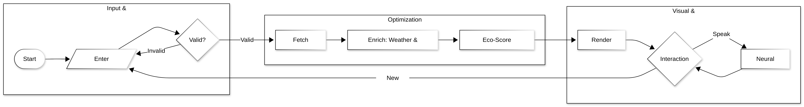

# 🌿 EcoRoute Optimizer

> **Smart Routing for a Greener Future.**  
> Calculate routes based on fuel efficiency, CO2 emissions, and environmental factors—not just travel time.


---

## 📋 Project Summary

**EcoRoute Optimizer** is an intelligent navigation and simulation platform designed to minimize carbon footprints. Unlike traditional GPS applications that prioritize the fastest path, this system performs a multi-dimensional analysis of **elevation gradients, real-time weather conditions, and traffic patterns** to identify the most fuel-efficient route.

The project features a high-performance **FastAPI** backend for complex physics-based cost modeling, an interactive **Leaflet.js** web dashboard, and a sophisticated **Autonomous Agent** that simulates dynamic environment changes and performs real-time re-routing.

---

## 🎥 Project Demo

Watch the full explanation and walkthrough of the project here:

[](https://vimeo.com/1152642420)

*(Link to be updated)*

---

## 🏗️ System Architecture

The system is built with a modular architecture, ensuring clear separation between core logic, API services, and the simulation agent.



### Core Components
1.  **Frontend**: Interactive web UI built with HTML5, Bootstrap, and Leaflet Maps for real-time visualization.
2.  **API Engine**: FastAPI-powered backend providing RESTful endpoints for route calculation and TTS generation.
3.  **Autonomous Agent**: A CLI-based simulation engine (`autonomous_agent.py`) that demonstrates the system's ability to react to dynamic environmental shifts.
4.  **Neural Voice Service**: Integration with Microsoft Edge TTS for high-quality, natural-sounding route guidance.

---

## 🔄 Control Flow & Logic

The application follows a rigorous data pipeline to convert raw geographic data into environmental insights:



### Environmental Intelligence
*   **Weather Service**: Fetches live data from Open-Meteo API.
*   **Elevation Service**: Analyzes terrain profiles via Open-Elevation API.
*   **Traffic Service**: Infers road conditions using OSRM duration deltas and historical patterns.
*   **Cost Model**: A physics-based engine that calculates fuel consumption (L) and CO2 (kg) by weighing distance, ascent, and external resistance factors.

---

## ✨ Key Features

*   **🌱 Eco-Routing**: Prioritizes routes with the lowest environmental impact.
*   **⛰️ Terrain Awareness**: Incorporates elevation gain into fuel consumption calculations.
*   **🌤️ Dynamic Weather**: Adjusts estimates based on real-time precipitation and wind speed.
*   **🤖 Autonomous Rerouting**: Agent-driven simulation that switches routes as conditions evolve.
*   **🗣️ AI Voice Guidance**: Crystal-clear neural voice summaries of trip metrics.
*   **🔑 API Key Free**: Utilizes open-source and free-tier APIs (Open-Meteo, Open-Elevation, OSRM, Edge TTS) for zero-cost operation.

---

## 🛠️ Technical Stack

- **Backend:** FastAPI (Python 3.9+)
- **Frontend:** HTML5, CSS3, JavaScript (Leaflet.js, Bootstrap 5)
- **Simulation:** Custom Autonomous Agent (Python)
- **Voice AI:** Microsoft Edge Neural TTS
- **Data APIs:**
  - **Routing:** OSRM (Open Source Routing Machine)
  - **Weather:** Open-Meteo
  - **Elevation:** Open-Elevation
- **Deployment:** Docker, Docker Compose, Vercel, Render

---

## 📂 Project Structure

```text
.
├── assets/                 # Documentation diagrams
├── backend/                # Containerized backend service
├── frontend/               # Containerized frontend service
├── autonomous_agent.py     # CLI Autonomous Simulation Agent
├── main.py                 # FastAPI Application Entry Point
├── core.py                 # Shared logic and environmental services
├── requirements.txt        # Python dependencies
└── docker-compose.yml      # Multi-container orchestration
```

---

## 🚀 Getting Started

### Prerequisites
*   Python 3.9+
*   Internet connection (for OSRM, Weather, and Elevation APIs)

### Local Installation

1.  **Clone the repository**
    ```bash
    git clone https://github.com/yourusername/ecoroute-optimizer.git
    cd ecoroute-optimizer
    ```

2.  **Install Dependencies**
    ```bash
    pip install -r requirements.txt
    ```

3.  **Run the Web Application**
    ```bash
    uvicorn main:app --reload
    ```
    Access the UI at `http://localhost:8000`.

4.  **Run the Autonomous Agent**
    ```bash
    python autonomous_agent.py
    ```

---

## 🐳 Docker Deployment

Run the entire stack using Docker Compose:

```bash
docker-compose up --build
```

---

## 📜 License
This project is licensed under the MIT License.
